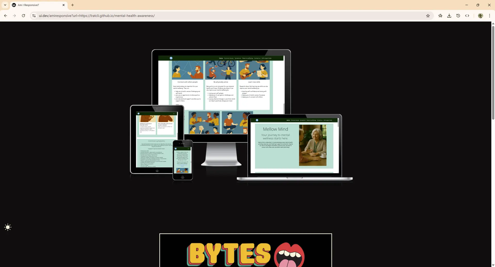
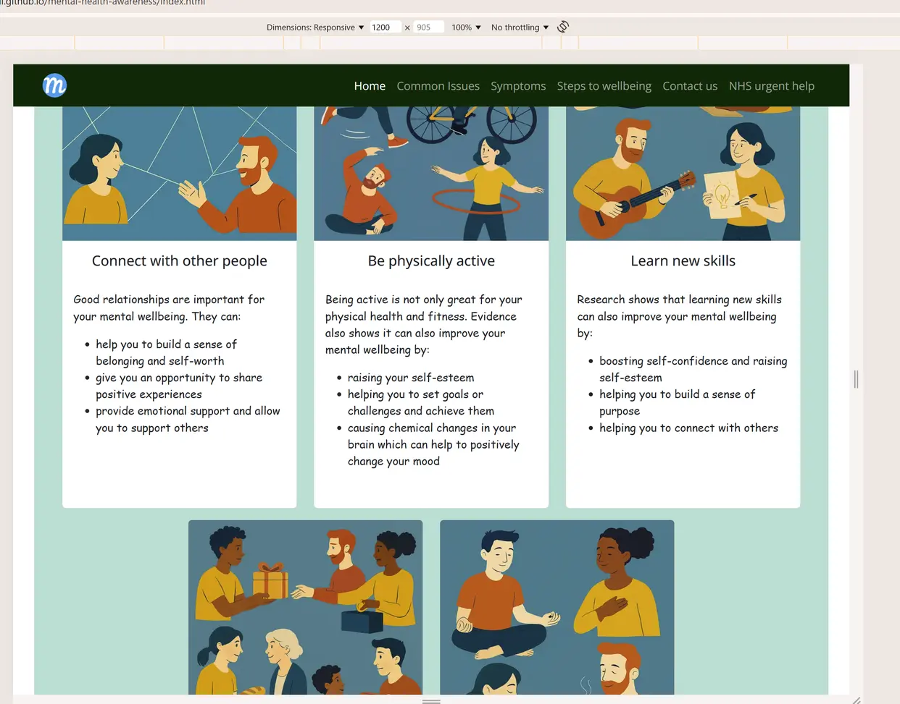

# Flagstone Project: Mellow Mind

## About

This is the flagstone project for a CodeInstitute course. Of the suggested topic, creating a site on "Mental Health Awareness" was chosen. The aim was to create something simple and usable that demonstrated many of the learning points that have been covered in the course so far.

The deployed site can be found here:

[https://lratcli.github.io/mental-health-awareness/index.html](https://lratcli.github.io/mental-health-awareness/index.html)

## Design and planning:

### User Stories

(User stories and acceptance criteria were generated by Copilot, with some developer selection and adjustment for project scope sduitability)

**AS A mobile user, I WANT TO navigate the website easily on my phone SO THAT I CAN access information wherever I am.**

- The website layout adapts smoothly to various mobile screen sizes using Bootstrap’s responsive grid
- All text is readable on mobile devices without zooming or horizontal scrolling.
- Navigation menus are easy to use on touch screens (e.g., collapsible navbar).
- Images and visuals scale appropriately for mobile screens.

**AS A visitor new to mental health topics, I WANT TO read clear information about common mental health issues SO THAT I CAN understand what people experience and reduce stigma.**

- display information about 3 - 5 common mental health conditions
- Each topic includes a brief description, common symptoms and possible ways to seek help
- All information is sourced from a reputable organisation e.g. nhs
- The layout is easy to read, with headings, bullet points, and short paragraphs.

**AS A user with accessibility needs, I WANT TO use the website with a screen reader SO THAT I CAN access mental health information independently.**

- All pages use a logical and semantic heading structure e.g. h1 h2 h3 for content organization.
- All images include descriptive alt text.
- Interactive elements (links, buttons, forms) are accessible via keyboard navigation (Tab, Enter, Space).
- The website passes basic accessibility checks (e.g. Lighthouse).

**AS A person feeling stressed, I WANT TO find simple wellness suggestions SO THAT I CAN try techniques to improve my mood and wellbeing.**

- The website displays a section with at least three simple wellness suggestions for stress relief.
- Each suggestion includes instructions that are easy to follow.
- Calming visuals (such as soothing images or gentle colors) accompany the wellness suggestions
- The section is responsive and easy to read on both desktop and mobile devices.

**AS A concerned friend or family member, I WANT TO learn how to support someone with mental health challenges SO THAT I CAN help them in a caring and effective way.**

- The website includes a dedicated section or page for friends and family support.
- Guidance on how to communicate sensitively with someone facing mental health challenges is provided
- A list of common signs and symptoms to look for is included.
- Links to reputable external resources and helplines are available

**AS A person seeking relaxation techniques, I WANT TO access embedded relaxation videos on the website SO THAT I CAN easily learn and practice calming exercises without leaving the site. The user needs are: high-quality embedded videos, clear instructions, and a distraction-free viewing experience.**

- The website includes a section with embedded relaxation videos viewable directly on the site.
- Videos are high-quality, relevant, and sourced from reputable platforms (e.g., YouTube, Vimeo)
- The video section is easy to find and accessible from the homepage.

**AS A teacher or advocate, I WANT TO download printable wellness resources SO THAT I CAN share reliable mental health information with others.**

- The website provides a section with downloadable wellness resources (e.g., fact sheets, educational materials) in PDF format.
- Each resource is clearly labelled and easy to find.
- All materials are sourced from or reviewed by reputable organizations.

---

There were seven user stories in total, of which four were selected as must-have, one as should-have, one could-have, and one was left in backlog as a won't-have.

The four must-have user stories were the only ones to be completed. At the time of writing, the project board looks like this:

### Wireframes

This project has two html files (index.html and confirm.html). Only one page, the main page index.html was planned out in wireframe. The wireframe was created in Balsamiq.

### Typography

Fonts were selected by going to Google fonts and looking for two fonts that were readable but pleasant, and that the author considered would work well together.

These fonts were:
- Open Sans
- Averia Libra

### Colour Scheme

The author had difficulty selecting a colour palette that they believe would be suitable using coolers.co or the Adobe colour wheel. For that reason, they chose a four colour palette on coolers.co and then adjusted them directly in style.css using the vscode colour picker.

The colours chosen are shown below as they would appear on the cooler.co website, but this is illustrative as this is not how they were chosen.

## Features

The site is a simple main page (index.html) with a second page (confirm.html) used only to confirm to a user that they have submitted a contact form.

### Main page

The main page (index.html) contains all the content on mental health, and a contact form at the end of the page. There is a sticky Bootstrap navbar at the top, and a footer at the very bottom. The head section uses a Bootstrap Carousel, and sections on the page use Bootstrap Cards. A Bootsrap button is used on the page to link to an NHS urgent health page.

Images use alt tags and links use aria-label attributes to aid screen readers.

Main page with navbar, showing Bootstrap Carousel:

Main page content, here using Bootstrap Cards:

### Confirm / Success page

This page is only accessed from the main page after successfully submitting a form. It features a similar navbar to the main page, only with fewer navigation options, and the same footer. One of the ways to navigate back to the main page is a Bootsrap button, visible just below the main "success" text.

### Navbar

The Bootstrap Navbar is fully responsive. Here is the navbar expanded from its "burger" configuration when used at tablet or smaller resolutions.

### Carousel (Bootstrap)

Here is the Bootstrap Carousel again, this time taking full width in its Bootstrap column:

### Form / Bootstrap Button

Main page contact form and footer, showing both a html form and Bootstrap Button:

## Testing

The project was tested with Lighthouse, W3C Markup and CSS tests, was tested for CSS browser compatibility with Autoprefixer CSS, and was tested manually on Chrome, Edge and Firefox.

### Google Lighthouse

The test machine is a 2014 Intel 4th gen i7, running Windows 11. Performance scores could vary even with no changes to the code, but at the time of testing the final version of the site, these were the results.

For the main page:

For the much simpler confirm / success page:

### Browser compatibility

Testing for browser compatibility with https://autoprefixer.github.io/ showed that two changes were necessary to improve CSS compatibility with Opera and Safari.

These additions were duly implemented into the CSS code in the final project:

### Code Validation:

Both HTML files and the single CSS file passed validation using W3C validators.

index.html:

confirm.html:

style.css:

### Responsiveness

Below are a large number of screenshots showing different screen size, both with devtools (for screen with validation) and taking up a full browser window of different widths.

## Bugs

Despite encountering many, many bugs during developement, at this time the developer is not aware of any

## Deployment

The github repo for the project is:
[https://github.com/lratcli/mental-health-awareness](https://github.com/lratcli/mental-health-awareness)

The project is deployed on GitHub pages here:
[https://lratcli.github.io/mental-health-awareness/](https://lratcli.github.io/mental-health-awareness/)

## Credit

Many resources were used in making this project.

### Code and content

- MS Copilot
- https://autoprefixer.github.io/ for additional CSS code for greater browser compatibility
- CodeInstitue for Javascript code on collapsing Bootstrap navbar on navigating to within same page

### Media

- Coolers.co and AbodbeAdobe Colour Wheel (https://color.adobe.com/create/color-wheel) while trying to find a suitable colour palette
- MS Copilot and Dall-E for generating images used in this website
- Favicons generated by favicon.io (https://favicon.io/)

### Acknowlegement

In researching for this site I leant heavily on the UK NHS wesbites and additionally Mayo Clinic. Pages that were of particular interest were:
- https://www.lpft.nhs.uk/contact-us/conditions-and-treatments
- https://www.nhs.uk/mental-health/self-help/guides-tools-and-activities/five-steps-to-mental-wellbeing/
- https://www.mayoclinic.org/diseases-conditions/mental-illness/symptoms-causes/syc-20374968
